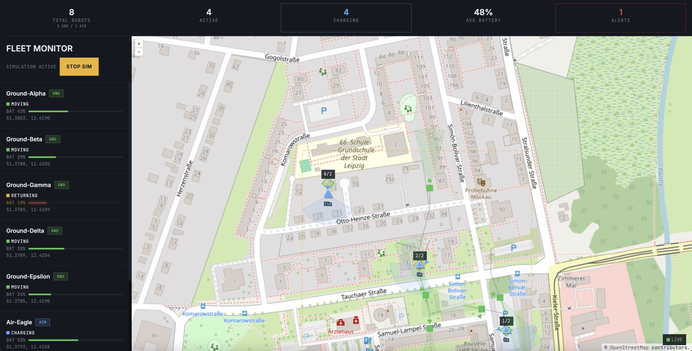
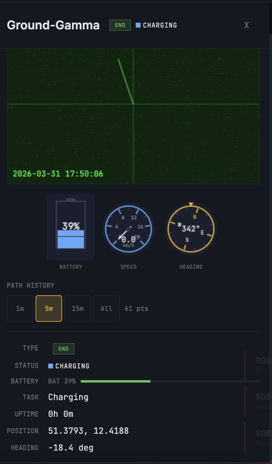

# Robot Fleet Monitor


Real-time robot fleet monitoring dashboard. Live robot positions on an interactive map with WebSocket updates, JWT authentication, and an industrial command center UI.

**[Live Demo](http://ophhucybyi4lyviki2p820je.152.53.230.125.sslip.io)** | **[API](http://n10i7xnofgeb5jv834ud72ye.152.53.230.125.sslip.io/api/health)**

Demo login: `admin@test.com` / `test123`

## Getting Started

**Prerequisites:** Docker and Docker Compose

```
docker compose up --build
```

Open `http://localhost` in your browser.

**Local development** (without Docker frontend):
```
docker compose up db redis api
cd frontend && npm install && npm run dev
```
Then open `http://localhost:5173`.

Default login: `admin@test.com` / `test123`

## Architecture

Node.js/Express REST API backed by PostgreSQL for persistence and Redis for caching and pub/sub. A server-side simulator generates robot patrol positions every 2 seconds, publishing to Redis. An authenticated WebSocket server (ws) broadcasts position updates to connected clients. The React frontend renders an OpenLayers map with live robot markers, fleet statistics, trail history, and alert notifications.

- **Backend:** Node.js 22, Express 5, PostgreSQL 17, Redis 7, ws
- **Frontend:** React 19, Vite, OpenLayers 10
- **Infrastructure:** Docker Compose

## Features

- JWT authentication
- Real-time WebSocket position updates
- OpenLayers map with animated markers
- Robot trail history
- Geofenced patrol zone overlay
- Fleet statistics dashboard
- Alert toasts (low battery, offline, recovery)
- Bidirectional click-to-highlight (map and list)
- Simulation start/stop controls

## Screenshots

### Dashboard



### Robot Detail Panel



## Project Structure

```
api/
  src/
    config/       # Database and Redis configuration
    db/           # Schema and seed scripts
    middleware/   # Auth, error handling, rate limiting
    routes/       # Express route handlers
    services/     # Business logic (simulation, robots)
    websocket/    # WebSocket server and broadcast
frontend/
  src/
    api/          # HTTP client utilities
    components/   # React UI components
    context/      # Auth and app state providers
    hooks/        # Custom React hooks
    styles/       # CSS with custom properties
docker-compose.yml
```
